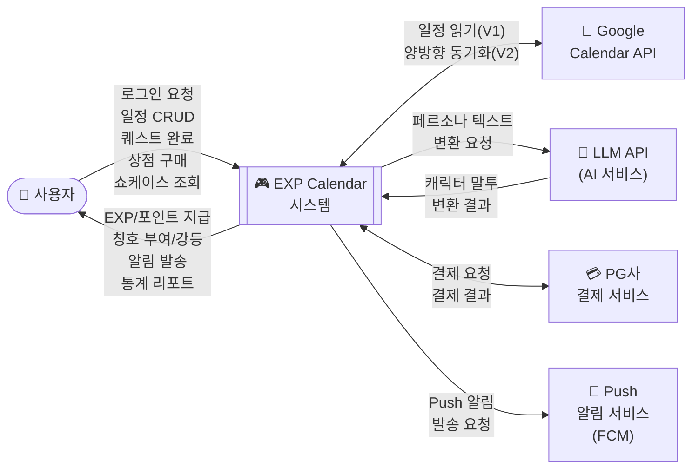
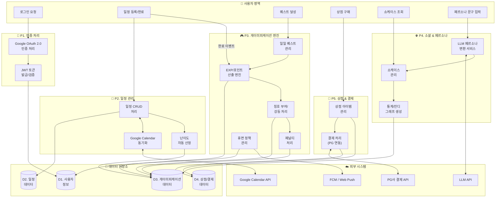
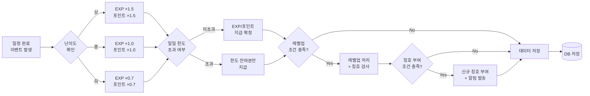

# EXP Calendar 소프트웨어 요구사항 정의서 (SRS)

> **문서 버전**: v2.0  
> **최종 수정일**: 2026-04-04  
> **프로젝트명**: EXP Calendar — 게이미피케이션 기반 일정 관리 시스템

---

## 1. 개요

### 1.1 목적

본 문서는 사용자의 할 일(귀찮은 일)을 게임화하여 시작의 허들을 낮추고, 시각적 보상과 성취감을 통해 지속적인 일정 관리를 돕는 게이미피케이션 기반 일정 관리 시스템 **'EXP Calendar'**의 소프트웨어 요구사항을 체계적으로 정의한다.

본 문서의 목적은 다음과 같다:
- 개발팀, 기획자, 이해관계자 간 요구사항에 대한 공통 이해 확보
- OMO(멀티 에이전트 오케스트레이션) 기반 병렬 개발을 위한 명확한 명세 기준 제공
- 테스트 및 검증의 기준 문서 역할 수행

### 1.2 범위

본 시스템의 개발 범위는 다음과 같다:

| 구분 | 내용 |
|------|------|
| **Phase 1 (V1)** | Google Calendar 단방향 연동, EXP/포인트/칭호/페널티/일일 퀘스트 보상 시스템, 14일 휴면 정책 및 복귀 보상, LLM 페르소나 대사 변환 및 잔디 그래프 쇼케이스, 포인트 기반 상점 및 PG사 연동 결제(IAP), 과거 데이터·온보딩 설문 기반 작업 난이도 자동 산정 |
| **Phase 2 (V2)** | Google Calendar 양방향 동기화(완료 상태 반영), 연말 결산 개인화 리포트(Recap) |

**범위 제외 항목:**
- 자체 캘린더 엔진 개발 (Google Calendar API 연동으로 대체)
- 네이티브 모바일 앱 (PWA로 대체)
- 실시간 멀티플레이어 기능

### 1.3 정의

| 용어 | 정의 |
|------|------|
| EXP (경험치) | 사용자가 일정을 완료하거나 퀘스트를 달성했을 때 획득하는 성장 수치. 레벨업의 기준이 된다. |
| 포인트 | 상점에서 아이템 구매에 사용되는 인앱 재화. 일정 완료·퀘스트 달성 시 지급되며, 유료 결제로도 충전 가능하다. |
| 칭호 | 특정 조건 달성 시 부여되는 명예 표식. 장착용(프로필 표시)과 전시용(쇼케이스 전시)으로 분리된다. |
| 쇼케이스 (Showcase) | 사용자의 캐릭터, 장착·전시 칭호, 연간 등급, 일일 성공 여부(잔디 그래프)를 타인에게 노출하는 소셜 공간. |
| 페르소나 시스템 | 사용자 입력 문구를 LLM이 캐릭터 성격·칭호 이력을 컨텍스트로 분석하여 캐릭터 고유의 말투로 변환해 주는 기능. |
| 잔디 그래프 | GitHub Contribution Graph 형태로 사용자의 매일 계획 성공 여부를 시각화한 차트. |
| 일일 퀘스트 | 매일 제공되는 고정 미션(계획 2개 추가, 계획 1개 완료, 쇼케이스 1회 방문). |
| 휴면 계정 | 14일 이상 연속 미접속 시 자동 전환되는 계정 상태. |
| 등급 하락 방어권 | 페널티로 인한 칭호 강등을 1회 방어하는 소비 아이템. |

### 1.4 약어

| 약어 | 정의 |
|------|------|
| SRS | Software Requirements Specification |
| OAuth | Open Authorization |
| IAP | In-App Purchase |
| PG | Payment Gateway |
| LLM | Large Language Model |
| PWA | Progressive Web Application |
| EXP | Experience Point |
| API | Application Programming Interface |
| JWT | JSON Web Token |
| CRUD | Create, Read, Update, Delete |
| FCM | Firebase Cloud Messaging |
| ERD | Entity-Relationship Diagram |
| SSL | Secure Sockets Layer |
| CI/CD | Continuous Integration / Continuous Deployment |

### 1.5 참고문헌

| 문서명 | 위치 | 비고 |
|--------|------|------|
| 프로젝트 일정표 | `docs/planning/project_schedule.md` | 10주 로드맵 및 마일스톤 |
| 발표 디자인 가이드 | `docs/planning/presentation_design_guide.md` | 컬러·타이포그래피·슬라이드 구성 |
| 아키텍처 정의서 | `docs/architecture.md` | 시스템 구성도 (작성 예정) |
| 디자인 정의서 | `docs/design.md` | 와이어프레임·컴포넌트 스타일 (작성 예정) |
| 보안 정의서 | `docs/security.md` | 인증 흐름·토큰 관리 (작성 예정) |
| 게이미피케이션 규칙 정의서 | `docs/gamification_rules.md` | EXP 공식·레벨업 테이블 (작성 예정) |
| 칭호·페널티·휴면 규칙 정의서 | `docs/title_penalty_rules.md` | 칭호 목록·강등 규칙 (작성 예정) |
| Google Calendar API 공식 문서 | https://developers.google.com/calendar | 외부 API 연동 참고 |

---

## 2. 일반적인 사항

### 2.1 시스템 기능

본 시스템은 다음의 핵심 기능 모듈로 구성된다:

| # | 기능 모듈 | 설명 |
|---|-----------|------|
| F-01 | **계정 및 인증** | Google OAuth 2.0 로그인, JWT 기반 세션 관리 |
| F-02 | **캘린더 연동** | Google Calendar API를 통한 일정 수집 및 CRUD |
| F-03 | **작업 난이도 관리** | 온보딩 설문 및 수행 이력 기반 난이도 자동 산정, 저레벨 사용자 가중치 부여 |
| F-04 | **일일 퀘스트** | 매일 고정 미션 제공(계획 2개 추가, 1개 완료, 쇼케이스 방문) 및 달성 보상 지급 |
| F-05 | **보상 엔진** | 일정 완료 시 EXP·포인트 지급 (일일 한도 적용) |
| F-06 | **칭호·페널티** | 목표 달성 시 칭호 부여, 기한 초과 시 강등 및 부정적 수식어 부착 (시스템 임의 리셋 불가) |
| F-07 | **상점·결제** | 커스터마이징 아이템·방어권·성격 변경 아이템 판매, PG사 연동 IAP |
| F-08 | **LLM 페르소나** | 칭호 이력과 캐릭터 성격을 결합한 LLM 프롬프팅을 통해 캐릭터 대사 생성 |
| F-09 | **쇼케이스 (소셜)** | 캐릭터·칭호·잔디 그래프·등급을 타 사용자에게 공개하는 프로필 공간 |
| F-10 | **휴면 계정 정책** | 14일 미접속 시 휴면 전환, 복귀 보상(대량 포인트 + 7일간 1.5배 EXP 버프 + 방어권 3개) |
| F-11 | **알림 (Push)** | 일정 시작 전·휴면 임박 경고 등 Push 알림 (FCM / Web Push) |
| F-12 | **통계·리포트** | 일일 성공/실패 시계열 그래프, 잔디 그래프, 주/월/연 성공률 등급 산출 |

### 2.2 사용자 특성

| 항목 | 설명 |
|------|------|
| **주요 대상** | 일정 관리를 자주 미루며, 게이미피케이션 요소를 통해 동기부여를 얻고자 하는 사용자 |
| **기술 수준** | Google 계정을 보유하고 웹 브라우저를 사용할 수 있는 일반 사용자 |
| **동기 유형** | 롤플레잉(캐릭터 육성·성격 부여), 수집(칭호), 경쟁(쇼케이스 공개) 요소에 반응하는 사용자 |
| **사용 환경** | 데스크톱 웹 브라우저 및 모바일 브라우저 (PWA) |

### 2.3 일반적 제약사항

| # | 제약사항 | 설명 |
|---|----------|------|
| C-01 | **포인트 일일 한도** | 하루 획득 가능한 무료 포인트의 최대 한도를 설정하여 경제 인플레이션 방지 |
| C-02 | **LLM 비용 최적화** | LLM API 호출 비용 최적화를 위한 토큰 수 및 호출 횟수 제한 필수 |
| C-03 | **Google API 할당량** | Google Calendar API의 일일 요청 할당량(Quota) 준수 |
| C-04 | **PG사 심사 의존성** | PG사 심사 지연 시 IAP 기능은 V2로 이관하고, 인앱 무료 재화만 V1에서 운영 |
| C-05 | **페널티 리셋 불가** | 칭호 페널티는 시스템에 의해 임의로 초기화될 수 없으며, 반드시 정상 일정 완료 또는 방어 아이템 사용을 통해서만 복구 가능 |
| C-06 | **개발 기간** | 10주 (2026-03-30 ~ 2026-06-07) 내 V1 기능 완성 및 배포 |

### 2.4 자료 흐름도

#### 2.4.1 시스템 전체 자료 흐름도 (Level 0 — Context Diagram)

#### 2.4.2 핵심 프로세스 자료 흐름도 (Level 1)

#### 2.4.3 보상 처리 프로세스 (Level 2 — 상세)

### 2.5 자료 사전

| 데이터 항목 | 타입 | 설명 | 제약 조건 |
|-------------|------|------|-----------|
| `user_id` | UUID | 사용자 고유 식별자 | PK, NOT NULL |
| `email` | VARCHAR(255) | Google 계정 이메일 | UNIQUE, NOT NULL |
| `display_name` | VARCHAR(100) | 사용자 표시 이름 | NOT NULL |
| `level` | INTEGER | 현재 레벨 | 기본값 1, ≥ 1 |
| `total_exp` | BIGINT | 누적 경험치 | 기본값 0, ≥ 0 |
| `current_points` | INTEGER | 현재 보유 포인트 | 기본값 0, ≥ 0 |
| `daily_points_earned` | INTEGER | 당일 획득 포인트 | 일일 한도 이하 |
| `account_status` | ENUM | 계정 상태 | `ACTIVE`, `DORMANT` |
| `last_login_at` | TIMESTAMP | 마지막 로그인 일시 | 휴면 판정 기준 |
| `schedule_id` | UUID | 일정 고유 식별자 | PK, NOT NULL |
| `title` | VARCHAR(200) | 일정 제목 | NOT NULL |
| `difficulty` | ENUM | 난이도 등급 | `LOW`, `MEDIUM`, `HIGH` |
| `status` | ENUM | 일정 상태 | `PENDING`, `COMPLETED`, `OVERDUE` |
| `due_date` | TIMESTAMP | 일정 마감 일시 | NOT NULL |
| `google_event_id` | VARCHAR(255) | Google Calendar 이벤트 ID | NULLABLE |
| `title_id` | UUID | 칭호 고유 식별자 | PK, NOT NULL |
| `title_name` | VARCHAR(100) | 칭호 이름 | NOT NULL |
| `title_grade` | ENUM | 칭호 등급 | `COMMON`, `RARE`, `EPIC`, `LEGENDARY` |
| `is_equipped` | BOOLEAN | 장착 여부 | 기본값 FALSE |
| `is_displayed` | BOOLEAN | 전시 여부 | 기본값 FALSE |
| `negative_modifier` | VARCHAR(100) | 부정적 수식어 (페널티) | NULLABLE |
| `quest_type` | ENUM | 퀘스트 유형 | `ADD_PLAN`, `COMPLETE_PLAN`, `VISIT_SHOWCASE` |
| `quest_completed` | BOOLEAN | 퀘스트 완료 여부 | 기본값 FALSE |
| `item_id` | UUID | 상점 아이템 식별자 | PK, NOT NULL |
| `item_category` | ENUM | 아이템 분류 | `CUSTOMIZE`, `DEFENSE`, `PERSONA` |
| `price` | INTEGER | 아이템 가격 (포인트) | > 0 |
| `persona_text` | TEXT | 페르소나 변환 텍스트 | LLM 출력 결과 |

---

## 3. 세부 요구사항

### 3.1 기능 요구사항

#### 3.1.1 UI/UX

| ID | 요구사항 | 우선순위 |
|----|----------|:--------:|
| FR-UI-01 | 노션 캘린더(Notion Calendar)와 유사한 웹 기반의 그리드(월/주 뷰) 및 리스트(일 뷰) 형태 뷰를 제공한다. | 필수 |
| FR-UI-02 | 다크 모드 기반의 게임 UI 테마를 기본 적용한다. | 필수 |
| FR-UI-03 | 반응형 레이아웃으로 데스크톱·태블릿·모바일 환경을 지원한다. | 필수 |
| FR-UI-04 | 일정 드래그 앤 드롭을 지원하여 직관적 일정 이동을 제공한다. | 필수 |

#### 3.1.2 인증 및 연동

| ID | 요구사항 | 우선순위 |
|----|----------|:--------:|
| FR-AUTH-01 | Google OAuth 2.0 기반 소셜 로그인을 지원한다. | 필수 |
| FR-AUTH-02 | JWT 기반 세션 관리를 적용한다. | 필수 |
| FR-AUTH-03 | Google Calendar API 연동을 통해 외부 일정을 읽어온다 (Phase 1). | 필수 |
| FR-AUTH-04 | Google Calendar 양방향 동기화(완료 상태 반영)를 제공한다 (Phase 2). | 선택 |

#### 3.1.3 난이도 및 보상 산정

| ID | 요구사항 | 우선순위 |
|----|----------|:--------:|
| FR-GAME-01 | 최초 가입 시 성향 설문을 트리거하여 초기 레벨 및 난이도 기준을 설정한다. | 필수 |
| FR-GAME-02 | 과거 수행 이력 데이터를 분석하여 작업 난이도를 자동으로 산정한다. | 필수 |
| FR-GAME-03 | 저레벨 사용자에 대해 EXP/포인트 가중치를 부여하여 초기 성장을 돕는다. | 필수 |
| FR-GAME-04 | 일일 퀘스트(계획 2개 추가, 1개 완료, 쇼케이스 방문) 완료 시 포인트 보상을 지급한다. | 필수 |

#### 3.1.4 휴면 계정 정책

| ID | 요구사항 | 우선순위 |
|----|----------|:--------:|
| FR-DORM-01 | 14일 이상 연속 미접속 시 자동으로 휴면 계정으로 전환한다. | 필수 |
| FR-DORM-02 | 휴면 복귀 시 성향 설문을 재실행한다. | 필수 |
| FR-DORM-03 | 휴면 복귀 보상으로 14일치 획득 가능 최대치 이상의 대량 포인트를 즉시 지급한다. | 필수 |
| FR-DORM-04 | 복귀 시점부터 7일간 1.5배 경험치 획득 버프를 적용한다. | 필수 |
| FR-DORM-05 | 최초 휴면 복귀 시 '등급 하락 방어권' 3개를 무료 지급한다. | 필수 |
| FR-DORM-06 | 휴면 전환 임박 시(13일차) 사전 접속 유도 경고 알림을 발송한다. | 필수 |

#### 3.1.5 칭호 및 페널티

| ID | 요구사항 | 우선순위 |
|----|----------|:--------:|
| FR-TITLE-01 | 작업 완료 조건에 따라 칭호를 부여하고 등급별 색상/아이콘으로 구분한다. | 필수 |
| FR-TITLE-02 | 장착용 칭호와 전시용 칭호를 분리하여 선택할 수 있다. | 필수 |
| FR-TITLE-03 | 일정 지연 시 장착 칭호를 자동 강등하고 부정적 수식어(명예적 페널티)를 부착한다. | 필수 |
| FR-TITLE-04 | 페널티는 정상적인 일정 완료 또는 방어 아이템 사용 시에만 복구 가능하다 (임의 초기화 불가). | 필수 |

#### 3.1.6 상점 및 결제

| ID | 요구사항 | 우선순위 |
|----|----------|:--------:|
| FR-SHOP-01 | 앱 내 상점을 구현한다. | 필수 |
| FR-SHOP-02 | 외부 PG사 연동을 통한 포인트 유료 결제(IAP)를 지원한다. | 필수 |
| FR-SHOP-03 | 판매 항목으로 캐릭터 커스터마이징 재화, 등급 하락 방어권, 캐릭터 성격·말투 설정 아이템을 제공한다. | 필수 |

#### 3.1.7 LLM 페르소나 및 쇼케이스

| ID | 요구사항 | 우선순위 |
|----|----------|:--------:|
| FR-SOC-01 | 타 사용자의 캐릭터, 장착/전시 칭호, 잔디 그래프, 종합 등급을 열람할 수 있다. | 필수 |
| FR-SOC-02 | 사용자 입력 텍스트를 LLM API(System Prompt에 성격·칭호 이력 주입)를 통해 캐릭터 말투로 변환하여 쇼케이스에 전시한다. | 필수 |
| FR-SOC-03 | 쇼케이스에서 타 사용자의 상세 일정 내용 및 실패율은 비공개 처리한다. | 필수 |

#### 3.1.8 알림

| ID | 요구사항 | 우선순위 |
|----|----------|:--------:|
| FR-NOTI-01 | 모바일 및 웹 환경에서 Push 알림을 지원한다. | 필수 |
| FR-NOTI-02 | 일정 시작 전 알림을 발송한다 (기본값 15분 전, 사용자 커스텀 설정 지원). | 필수 |
| FR-NOTI-03 | 휴면 전환 임박 시 사전 접속 유도 경고 알림을 발송한다. | 필수 |

#### 3.1.9 통계 및 리포트

| ID | 요구사항 | 우선순위 |
|----|----------|:--------:|
| FR-STAT-01 | 일일 성공/실패 시계열 그래프를 제공한다. | 필수 |
| FR-STAT-02 | 매일 계획 성공 여부를 GitHub 잔디(Contribution Graph) 형태로 시각화한다. | 필수 |
| FR-STAT-03 | 주/월/연 단위 누적 성공률을 연산하여 등급(Rating)을 부여한다. | 필수 |
| FR-STAT-04 | 연말 결산 개인화 리포트(Recap)를 제공한다 (Phase 2). | 선택 |

### 3.2 성능 요구사항

| ID | 요구사항 | 목표 수치 |
|----|----------|-----------|
| PR-01 | 일반 API 응답 시간 | 평균 200ms 이내, 최대 500ms 이내 |
| PR-02 | LLM 텍스트 변환 응답 시간 | 최대 5초 이내 (로딩 인디케이터 필수 제공) |
| PR-03 | 페이지 초기 로딩 시간 (LCP) | 2.5초 이내 |
| PR-04 | 동시 접속 사용자 처리 | 최소 1,000명 동시 접속 지원 |
| PR-05 | 외부 API 호출 실패 시 | 최대 3회 자동 재시도, 지수 백오프 적용, 에러 피드백 UI 제공 |
| PR-06 | 데이터베이스 쿼리 성능 | 95 percentile 기준 100ms 이내 |

### 3.3 인터페이스 요구사항

#### 3.3.1 외부 시스템 인터페이스

| ID | 인터페이스 | 프로토콜 | 방향 | 설명 |
|----|-----------|----------|------|------|
| IF-01 | Google OAuth 2.0 | HTTPS/REST | 양방향 | 사용자 인증 및 토큰 발급 |
| IF-02 | Google Calendar API | HTTPS/REST | 단방향→양방향 | 일정 데이터 읽기(V1), 동기화(V2) |
| IF-03 | LLM API (OpenAI 등) | HTTPS/REST | 양방향 | 페르소나 텍스트 변환 요청·응답 |
| IF-04 | PG사 결제 API | HTTPS/REST | 양방향 | 결제 요청·결과 수신·환불 처리 |
| IF-05 | FCM / Web Push | HTTPS | 단방향 | Push 알림 발송 |

#### 3.3.2 내부 인터페이스

| ID | 인터페이스 | 설명 |
|----|-----------|------|
| IF-INT-01 | Client ↔ Server | RESTful API (JSON), JWT 인증 헤더 |
| IF-INT-02 | Server ↔ Database | PostgreSQL 연결 (Connection Pool) |

### 3.4 운영 요구사항

| ID | 요구사항 | 설명 |
|----|----------|------|
| OR-01 | **배포 방식** | CI/CD 파이프라인(GitHub Actions)을 통한 자동화 배포 |
| OR-02 | **무중단 배포** | Blue-Green 또는 Rolling 배포 전략으로 서비스 중단 최소화 |
| OR-03 | **모니터링** | AWS CloudWatch를 통한 서버 상태·에러율·응답 시간 실시간 모니터링 |
| OR-04 | **로깅** | 구조화된 로그(JSON 포맷) 수집 및 일정 기간 보관 |
| OR-05 | **백업 정책** | PostgreSQL 데이터 일일 자동 백업, 최소 30일 보관 |
| OR-06 | **장애 대응** | 장애 발생 시 30분 이내 1차 대응, 4시간 이내 복구 목표 |
| OR-07 | **스케일링** | AWS Auto Scaling을 통한 트래픽 기반 자동 확장 |

### 3.5 자원 요구사항

#### 3.5.1 하드웨어/인프라 자원

| 자원 | 사양 | 비고 |
|------|------|------|
| **웹 서버** | AWS EC2 t3.medium 이상 (또는 ECS Fargate) | Auto Scaling 적용 |
| **데이터베이스** | AWS RDS PostgreSQL (db.t3.medium) | pgvector 확장 고려 |
| **스토리지** | AWS S3 | 정적 자산·백업 데이터 저장 |
| **CDN** | AWS CloudFront | 정적 자산 배포 및 글로벌 캐싱 |
| **도메인/SSL** | Route53 + ACM | HTTPS 인증서 |

#### 3.5.2 소프트웨어 자원

| 구분 | 기술 | 버전/사양 |
|------|------|-----------|
| 프론트엔드 | Next.js (React) | 최신 안정 버전, PWA 적용 |
| 백엔드 | Go (Golang) | 최신 안정 버전, Gin 또는 Echo 프레임워크 |
| 데이터베이스 | PostgreSQL | 15+ (pgvector 확장 호환) |
| 인프라 | AWS (EC2/ECS, RDS, S3, CloudFront) | Free Tier 활용 후 점진적 확장 |
| CI/CD | GitHub Actions | 자동 빌드·테스트·배포 |
| 컨테이너 | Docker / Docker Compose | 개발·배포 환경 통일 |

#### 3.5.3 인적 자원

| 역할 | 인원 | 책임 |
|------|------|------|
| 기획·설계·검수 | 1명 | 핵심 문서 작성, 비즈니스 규칙 정의, QA 검수, 발표 |
| OMO 에이전트 (AI) | 다수 | API/DB 명세 생성, FE·BE 병렬 코딩, 버그 수정 |

### 3.6 검증 요구사항

| ID | 검증 항목 | 검증 방법 | 합격 기준 |
|----|----------|-----------|-----------|
| VR-01 | Google OAuth 로그인 | 실제 Google 계정으로 로그인 테스트 | 로그인 성공 및 사용자 정보 정상 표시 |
| VR-02 | 일정 CRUD | 단위 테스트 + 수동 테스트 | 생성·조회·수정·삭제 전 과정 정상 동작 |
| VR-03 | Google Calendar 동기화 | 실제 Google Calendar 데이터 연동 테스트 | 외부 일정이 앱 내에 정확히 반영 |
| VR-04 | EXP/포인트 산출 | 게이미피케이션 규칙 정의서 수치 대조 | 정의서 수치와 실제 지급량 100% 일치 |
| VR-05 | 일일 퀘스트 완료 판정 | 각 퀘스트 유형별 완료 조건 테스트 | 3종 퀘스트 조건 정확히 판정 |
| VR-06 | 칭호 부여/강등 | 조건별 시나리오 테스트 | 부여·강등·수식어 부착이 규칙대로 동작 |
| VR-07 | 휴면 전환/복귀 | 14일 미접속 시뮬레이션 | 휴면 전환 → 복귀 보상 정상 지급 |
| VR-08 | LLM 페르소나 변환 | 다양한 입력 텍스트로 변환 품질 테스트 | 캐릭터 말투 반영, 5초 이내 응답 |
| VR-09 | 결제 플로우 | PG 테스트 환경에서 결제 테스트 | 결제 → 포인트 충전 → 아이템 구매 정상 동작 |
| VR-10 | Push 알림 | 웹/모바일 환경에서 알림 수신 테스트 | 설정된 시간에 정확히 알림 수신 |

### 3.7 인수 테스트 요구사항

| ID | 테스트 시나리오 | 절차 | 합격 기준 |
|----|---------------|------|-----------|
| AT-01 | **신규 사용자 온보딩** | Google 로그인 → 성향 설문 완료 → 메인 캘린더 진입 | 전 과정 10초 이내 완료, 초기 레벨 정상 설정 |
| AT-02 | **일정 관리 전체 흐름** | 일정 생성 → 일정 완료 → EXP/포인트 확인 → 칭호 확인 | CRUD·보상 지급·칭호 반영 정상 |
| AT-03 | **일일 퀘스트 달성** | 계획 2개 추가 → 1개 완료 → 쇼케이스 방문 → 보상 확인 | 3종 미션 완료 시 보상 정상 지급 |
| AT-04 | **페널티 및 복구** | 일정 지연 → 칭호 강등 확인 → 방어권 사용 → 복구 확인 | 강등·수식어·방어권 동작 정상 |
| AT-05 | **쇼케이스 열람** | 타 사용자 쇼케이스 접근 → 캐릭터·칭호·잔디 확인 | 공개 정보만 노출, 민감 데이터 비공개 |
| AT-06 | **상점 구매 및 결제** | 아이템 선택 → 포인트 구매 또는 IAP 결제 → 인벤토리 확인 | 결제·아이템 지급·잔액 차감 정상 |
| AT-07 | **휴면 복귀 시나리오** | 14일 미접속 → 복귀 → 설문 → 보상 확인 | 경고 알림·휴면 전환·복귀 보상 전 과정 정상 |

### 3.8 문서화 요구사항

| ID | 요구사항 | 설명 |
|----|----------|------|
| DR-01 | **API 명세서** | 모든 RESTful API 엔드포인트의 요청/응답 형식, 에러 코드를 문서화한다. |
| DR-02 | **DB 스키마 문서** | ERD 및 테이블 정의서를 작성하고 변경 이력을 관리한다. |
| DR-03 | **사용자 가이드** | 주요 기능별 사용 방법을 서술한 가이드를 제공한다. |
| DR-04 | **기술 문서 (README)** | 프로젝트 개요, 설치·실행 방법, 환경 변수 목록을 README에 기술한다. |
| DR-05 | **변경 관리 로그** | 요구사항·설계 변경 시 변경 사유, 영향 범위, 승인 이력을 기록한다. |
| DR-06 | **코드 주석** | 복잡한 비즈니스 로직(EXP 산출, 칭호 강등 등)에 대한 인라인 주석을 필수로 작성한다. |

### 3.9 보안 요구사항

| ID | 요구사항 | 설명 |
|----|----------|------|
| SR-01 | **토큰 관리** | OAuth 액세스·리프레시 토큰을 암호화하여 안전하게 저장·관리한다. |
| SR-02 | **HTTPS 통신** | 모든 클라이언트-서버, 서버-외부 API 간 통신에 HTTPS(TLS 1.2+)를 적용한다. |
| SR-03 | **프라이버시 통제** | 쇼케이스에서 사용자의 상세 일정 내용, 실패율 등 민감 데이터를 타인에게 비공개 처리한다. |
| SR-04 | **API 인증** | 모든 API 요청에 JWT 토큰 기반 인증을 적용하고, 비인가 접근을 차단한다. |
| SR-05 | **결제 보안** | 결제 정보 송수신 시 PCI DSS 가이드라인을 준수하고, 서버에 카드 정보를 직접 저장하지 않는다. |
| SR-06 | **입력 검증** | 모든 사용자 입력에 대해 서버 측 유효성 검사 및 SQL Injection/XSS 방어를 적용한다. |
| SR-07 | **LLM 프롬프트 보안** | LLM 호출 시 프롬프트 인젝션 공격을 방어하고, 사용자 입력을 필터링한다. |
| SR-08 | **시크릿 관리** | API 키, DB 패스워드 등 비밀 정보를 환경 변수 또는 AWS Secrets Manager로 관리한다. |

### 3.10 이식성 요구사항

| ID | 요구사항 | 설명 |
|----|----------|------|
| POR-01 | **크로스 브라우저** | Chrome, Safari, Firefox, Edge 최신 2개 버전에서 동일한 UX를 제공한다. |
| POR-02 | **크로스 플랫폼** | 데스크톱(Windows, macOS) 및 모바일(iOS, Android) 브라우저에서 동작한다. |
| POR-03 | **PWA 지원** | Progressive Web App으로 모바일 홈 화면 설치와 오프라인 기본 기능을 지원한다. |
| POR-04 | **컨테이너화** | Docker 기반 컨테이너화를 통해 개발·스테이징·프로덕션 환경 간 이식성을 보장한다. |

### 3.11 시스템 요구사항

#### 3.11.1 클라이언트 시스템 요구사항

| 항목 | 최소 사양 | 권장 사양 |
|------|-----------|-----------|
| 브라우저 | Chrome 90+, Safari 14+, Firefox 88+, Edge 90+ | 최신 버전 |
| 해상도 | 360×640 (모바일) | 1920×1080 (데스크톱) |
| 네트워크 | 3G 이상 | Wi-Fi / LTE 이상 |
| JavaScript | ES2020 지원 | ES2022 지원 |

#### 3.11.2 서버 시스템 요구사항

| 항목 | 사양 |
|------|------|
| OS | Linux (Ubuntu 26.04 LTS) |
| 런타임 | Go 1.21+, Node.js 20 LTS+ |
| DB | PostgreSQL 15+ (pgvector 확장 호환) |
| 메모리 | 최소 4GB RAM |
| 스토리지 | 최소 50GB SSD |
| 네트워크 | HTTPS (TLS 1.2+), 고정 IP 또는 로드밸런서 |

### 3.12 신뢰성 요구사항

| ID | 요구사항 | 목표 |
|----|----------|------|
| REL-01 | **가용성 (Availability)** | 월간 99.5% 이상 가용성 보장 (월 최대 3.6시간 다운타임 허용) |
| REL-02 | **데이터 무결성** | EXP/포인트/칭호 트랜잭션의 ACID 속성을 보장하여 데이터 손실을 방지한다. |
| REL-03 | **장애 복구 (MTTR)** | 평균 복구 시간 4시간 이내를 목표로 한다. |
| REL-04 | **데이터 백업** | 일일 자동 백업, 최소 30일 보관, 복원 테스트 분기별 1회 실시한다. |
| REL-05 | **외부 API 장애 대응** | Google/LLM/PG API 장애 시 서비스 핵심 기능(캘린더 조회, 기존 데이터 표시)은 정상 동작한다. |
| REL-06 | **에러 핸들링** | 모든 예외 상황에 대해 사용자 친화적 에러 메시지를 표시하고, 서버 로그에 상세 정보를 기록한다. |

### 3.13 유지 보수성 요구사항

| ID | 요구사항 | 설명 |
|----|----------|------|
| MR-01 | **모듈화 설계** | 각 기능 모듈(인증, 게이미피케이션, 상점, 소셜)을 독립적으로 배포·수정할 수 있도록 설계한다. |
| MR-02 | **코드 컨벤션** | Go(golangci-lint), TypeScript(ESLint + Prettier) 표준 코딩 컨벤션을 적용하고, CI에서 자동 검사한다. |
| MR-03 | **테스트 자동화** | 핵심 비즈니스 로직(EXP 산출, 칭호 강등, 결제)에 대해 단위 테스트를 작성하고, CI/CD에서 자동 실행한다. |
| MR-04 | **DB 마이그레이션** | 스키마 변경 시 마이그레이션 스크립트를 사용하여 버전 관리하고, 롤백 가능하도록 한다. |
| MR-05 | **의존성 관리** | 외부 패키지 의존성을 정기적으로 업데이트하고, 보안 취약점을 모니터링한다. |
| MR-06 | **로깅·모니터링** | 구조화된 로그(JSON)와 CloudWatch 대시보드를 통해 시스템 상태를 상시 파악할 수 있도록 한다. |

### 3.14 안전 요구사항

| ID | 요구사항 | 설명 |
|----|----------|------|
| SAF-01 | **과도한 사용 방지** | 연속 사용 시간이 2시간을 초과할 경우, 선택적 휴식 권고 알림을 제공한다. |
| SAF-02 | **과금 안전장치** | 월간 유료 결제 상한선(사용자 설정 가능)을 제공하여 과도한 과금을 방지한다. |
| SAF-03 | **페널티 심리적 안전** | 칭호 강등·부정적 수식어가 사용자에게 과도한 심리적 압박을 주지 않도록, 회복 경로를 명확히 안내한다. |
| SAF-04 | **LLM 출력 필터링** | LLM이 생성한 페르소나 텍스트에 비속어, 혐오 표현, 유해 콘텐츠가 포함되지 않도록 출력 필터를 적용한다. |
| SAF-05 | **아동 보호** | 14세 미만 사용자의 가입을 제한하거나, 보호자 동의 절차를 적용한다. |
| SAF-06 | **데이터 삭제 권한** | 사용자는 언제든지 자신의 계정 및 모든 관련 데이터의 영구 삭제를 요청할 수 있다. |

---

> **문서 끝**  
> 본 문서의 변경 이력은 Git 커밋 히스토리를 통해 관리됩니다.