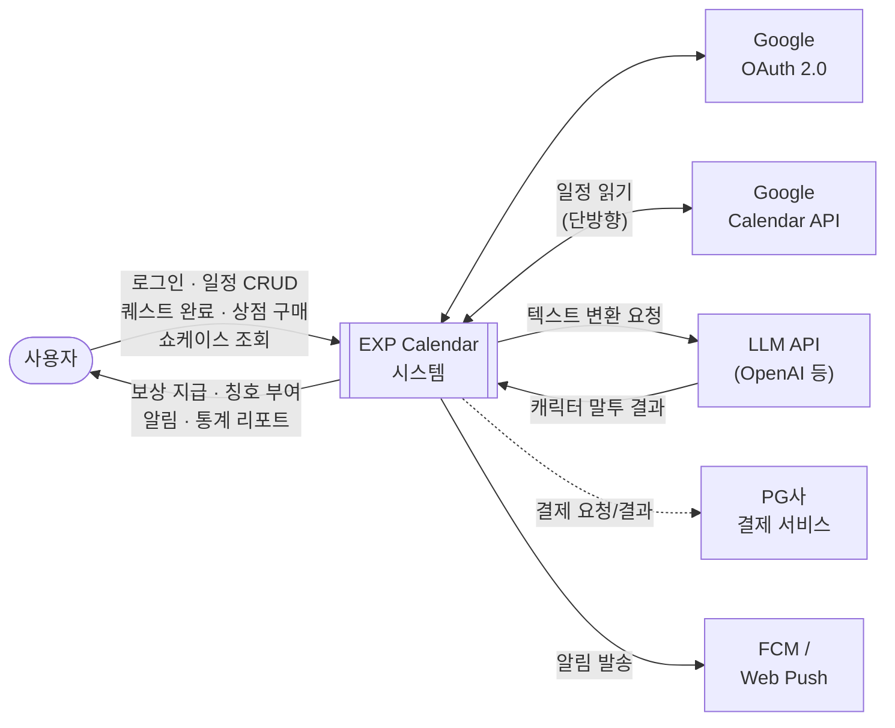
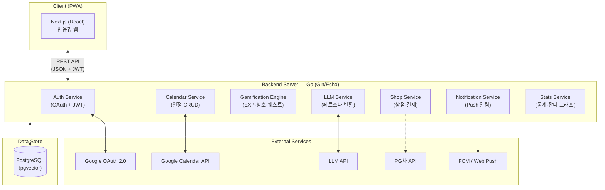
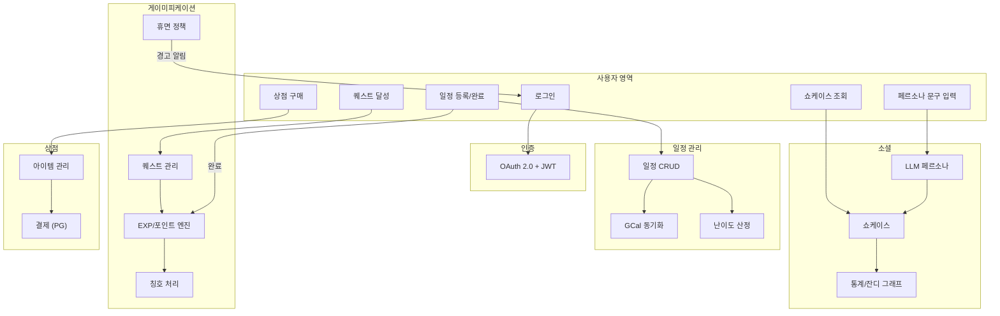
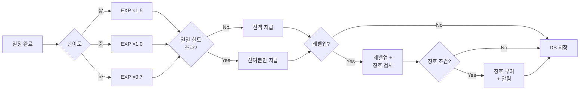
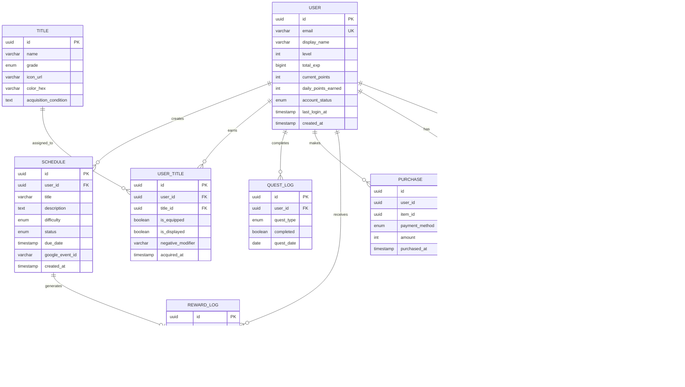

# EXP Calendar — 소프트웨어 요구사항 명세서 (SRS)

> **표준 기반**: IEEE 830-1998 Software Requirements Specification  
> **문서 버전**: v1.2  
> **최종 수정일**: 2026-05-12  
> **프로젝트명**: EXP Calendar — 게이미피케이션 기반 일정 관리 시스템

#### 팀 역할 분담

| 담당 | 이름 | 범위 |
|------|------|------|
| **인프라** | 정다우 | 온프레미스 서버 구축, Docker, CI/CD, DB 운영, 배포 파이프라인 |
| **개발** | 신강민 | FE(Next.js) + BE(Go/Gin) 기능 구현, API 개발, 테스트 |
| **발표** | 백인서 | 발표 자료 제작, 데모 시나리오 구성, 프레젠테이션 |

---

## 1. Introduction (서론)

### 1.1 Purpose (목적)

본 문서는 게이미피케이션 기반 일정 관리 시스템 **'EXP Calendar'**의 소프트웨어 요구사항을 IEEE 830-1998 표준에 따라 명세한다.

EXP Calendar는 사용자의 할 일(귀찮은 일)을 게임화하여 시작의 허들을 낮추고, 시각적 보상과 성취감을 통해 지속적인 일정 관리를 돕는 시스템이다.

본 문서의 목적은 다음과 같다:

- 개발팀, 기획자, 이해관계자 간 요구사항에 대한 **공통 이해 확보**
- OMO(멀티 에이전트 오케스트레이션) 기반 병렬 개발을 위한 **명확한 명세 기준 제공**
- 테스트 및 검증의 **기준 문서** 역할 수행
- 향후 유지보수·확장 시 **변경 영향 분석의 기초 자료** 제공

### 1.2 Document Conventions (문서 규약)

| 규약 | 설명 |
|------|------|
| **요구사항 ID 체계** | `[카테고리]-[번호]` 형식. 예: `FR-AUTH-01` (기능-인증-01번) |
| **우선순위 표기** | `필수` — 반드시 구현 / `권장` — 목표, 일정에 따라 조정 가능 / `선택` — 현재 범위 외 (V2 후보) |
| **용어 강조** | **굵은 글씨**는 정의된 기술 용어 또는 핵심 개념 |
| **Mermaid 다이어그램** | 시스템 구조 및 흐름도는 Mermaid 코드 블록으로 표현 |

본 문서 전체에서 개별 요구사항에 명시된 우선순위가 없는 경우, 해당 요구사항은 `필수`로 간주한다.

### 1.3 Intended Audience and Reading Suggestions (대상 독자 및 읽는 방법)

| 대상 독자 | 권장 읽기 섹션 | 설명 |
|-----------|---------------|------|
| **프로젝트 관리자** | 1장, 2장 전체 | 제품 범위, 제약사항, 일정 의존성 파악 |
| **개발자 (FE/BE)** | 2.1, 3.1, 3.2, 3.3, 3.4 | 인터페이스 명세, 기능 요구사항, DB 구조 |
| **OMO 에이전트 (AI)** | 3장 전체 | 구현 명세 기반 코드 생성에 필요한 구체적 요구사항 |
| **QA / 테스터** | 3.2, 3.3, 3.6 | 기능·성능 검증 기준, 품질 속성 |
| **디자이너** | 2.1, 3.1.1 | 시스템 맥락, UI 요구사항 |
| **이해관계자 / 발표 청중** | 1장, 2.2 | 프로젝트 개요와 핵심 기능 요약 |

### 1.4 Product Scope (제품 범위)

**EXP Calendar**는 Google Calendar를 기반으로, 사용자의 일정 완료에 대해 경험치(EXP)·포인트·칭호를 보상하고, LLM 기반 캐릭터 페르소나와 소셜 쇼케이스를 제공하는 게이미피케이션 일정 관리 시스템이다.

#### 범위 내 (In Scope) — 병렬 개발 파트 분할

> **개발 기한**: 1주(신강민 담당). 각 파트는 독립적으로 병렬 개발 가능하도록 설계되었다. Subagent가 파트별로 분담하여 동시 구현한다.

| Part | 영역 | 포함 요구사항 | 우선순위 | 의존성 |
|------|------|---------------|:--------:|--------|
| **A — 인증·캘린더** | Google OAuth, JWT, GCal 연동 | FR-AUTH-01~03 | 필수 | 없음 (최우선 착수) |
| **B — 게이미피케이션 엔진** | EXP·포인트·레벨업·일일한도·설문·퀘스트 | FR-GAME-01·03~05 | 필수 | Part A (사용자 인증) |
| **C — 칭호·페널티** | 칭호 부여·등급·페널티 복구 | FR-TITLE-01·04 | 필수 | Part B (EXP/레벨) |
| **D — 상점·아이템** | 인앱 상점, 무료 재화 구매 | FR-SHOP-01·03 | 필수 | Part A (사용자 인증) |
| **E — LLM 페르소나·쇼케이스** | 캐릭터 말투 변환, 공개 프로필 열람 | FR-SOC-01~03 | 필수 | Part A (사용자 인증) |
| **F — 알림** | Push 알림, 일정 리마인더 | FR-NOTI-01~02 | 필수 | Part A (사용자 인증) |
| **G — 통계·잔디 그래프** | 잔디 그래프, 시계열, 등급 | FR-STAT-02 | 필수 | Part B (보상 데이터) |
| **H — 프론트엔드 UI** | 캘린더 뷰, 게임 HUD, 다크 테마, 반응형 | UI-01~07 | 필수 | Part A~G의 API |
| **I — 휴면 계정 정책** | 자동 휴면, 복귀 보상, 경고 알림 | FR-DORM-01~06, FR-NOTI-03 | 권장 | Part B + F |
| **J — 고급 기능** | 난이도 자동 산정, 칭호 분리·강등, 고급 통계 | FR-GAME-02, FR-TITLE-02~03, FR-STAT-01·03 | 권장 | Part B + C |

**병렬 실행 전략:**
```
[Part A: 인증·캘린더] ──완료──┬──→ [Part B: 게이미피케이션] ──→ [Part C: 칭호]
                              ├──→ [Part D: 상점]              ──→ [Part G: 통계]
                              ├──→ [Part E: LLM·쇼케이스]
                              ├──→ [Part F: 알림]
                              └──→ [Part H: 프론트엔드 UI] (API 완성에 따라 점진적 통합)
```
- Part A 완료 후 B·D·E·F·H는 **동시 착수** 가능
- Part I·J는 필수 파트 완성 후 **여유 시** 진행

**파트별 완료 기준:**
- **Part A**: Google 로그인 → JWT 발급 → GCal 일정 목록 조회 API 동작
- **Part B**: 일정 완료 시 EXP/포인트 지급, 레벨업, 일일 한도 적용 확인
- **Part C**: 조건 충족 시 칭호 자동 부여, 방어 아이템으로 페널티 복구
- **Part D**: 상점 아이템 목록 조회, 포인트로 구매 처리
- **Part E**: 텍스트 입력 → LLM 말투 변환, 타 사용자 쇼케이스 열람
- **Part F**: 일정 시작 전 Push 알림 발송
- **Part G**: 잔디 그래프 렌더링
- **Part H**: 캘린더 그리드/리스트 뷰, HUD, 반응형 레이아웃 동작

#### 범위 외 (Out of Scope)

- 자체 캘린더 엔진 개발 (Google Calendar API 연동으로 대체)
- 네이티브 iOS / Android 앱 (PWA로 대체)
- 실시간 멀티플레이어 / 소셜 피드 기능
- 자체 AI 모델 학습 (외부 LLM API 호출로 대체)

**V2 후보 (현재 범위 외):**

| 요구사항 ID | 기능 | 설명 |
|-------------|------|------|
| FR-AUTH-04 | Google Calendar 양방향 동기화 | 완료 상태를 Google Calendar에 반영 |
| FR-STAT-04 | 연말 결산 개인화 리포트 | 연간 활동 Recap 제공 |
| FR-SHOP-02 | PG사 연동 유료 결제(IAP) | 인앱 유료 재화 판매 |

### 1.5 References (참고 문헌)

| # | 문서명 | 위치 / URL | 비고 |
|---|--------|-----------|------|
| 1 | IEEE 830-1998 표준 | IEEE Std 830-1998 | 본 문서의 구조적 기반 |
| 2 | 프로젝트 일정표 | `docs/planning/project_schedule.md` | 2주 개발 일정 및 마일스톤 |
| 3 | 발표 디자인 가이드 | `docs/planning/presentation_design_guide.md` | 컬러·타이포 |
| 4 | 요구사항 정의서 (기존) | `docs/planning/requirements.md` | 기존 요구사항 원본 |
| 5 | 아키텍처 정의서 | `docs/architecture.md` | 시스템 구성도 (작성 예정) |
| 6 | 보안 정의서 | `docs/security.md` | 인증 흐름·토큰 관리 (작성 예정) |
| 7 | 게이미피케이션 규칙 정의서 | `docs/gamification_rules.md` | EXP 공식·레벨업 (작성 예정) |
| 8 | Google Calendar API 문서 | https://developers.google.com/calendar | 외부 API |
| 9 | Google OAuth 2.0 문서 | https://developers.google.com/identity | 인증 프로토콜 |

---

## 2. Overall Description (전체 설명)

### 2.1 Product Perspective (제품 관점)

EXP Calendar는 독립 제품(Self-contained product)이 아니라, 다수의 외부 서비스에 의존하는 **통합 시스템(Integrated System)**이다. 아래 다이어그램은 시스템이 외부 환경과 맺는 관계를 보여준다.

#### 2.1.1 시스템 컨텍스트 다이어그램



> 실선: 현재 구현 범위 / 점선: V2 후보 (현재 범위 외)

#### 2.1.2 시스템 아키텍처 개요



#### 2.1.3 기술 스택

| 계층 | 기술 | 선정 사유 |
|------|------|-----------|
| 프론트엔드 | **Next.js (React)** | 반응형 웹 + PWA, SSR/SSG 지원 |
| 백엔드 | **Go (Gin/Echo)** | 고성능 동시성 처리, 빠른 LLM API 통신 |
| 데이터베이스 | **PostgreSQL** | 안정적 트랜잭션, pgvector 확장으로 AI 벡터 데이터 대응 |
| 인프라 | **온프레미스** (Docker Compose, Nginx, 로컬 스토리지) | 비용 절감, 직접 관리 |
| CI/CD | **GitHub Actions** | 자동 빌드·테스트·배포 파이프라인 |
| 컨테이너 | **Docker** | 환경 일관성 보장 |

### 2.2 Product Functions (제품 기능 요약)

본 시스템의 핵심 기능을 아래와 같이 요약한다. 각 기능의 상세 명세는 3.2절에서 기술한다.

| # | 기능 모듈 | 요약 설명 |
|---|-----------|-----------|
| F-01 | **계정 및 인증** | Google OAuth 2.0 로그인, JWT 세션 관리 |
| F-02 | **캘린더 연동** | Google Calendar API 일정 수집 및 CRUD |
| F-03 | **작업 난이도 관리** | 온보딩 설문·수행 이력 기반 난이도 자동 산정 |
| F-04 | **일일 퀘스트** | 매일 고정 미션 3종 제공 및 달성 보상 |
| F-05 | **보상 엔진** | 일정 완료 시 EXP·포인트 지급 (일일 한도 적용) |
| F-06 | **칭호·페널티** | 목표 달성 칭호 부여, 기한 초과 강등·수식어 부착 |
| F-07 | **상점·결제** | 인앱 상점(무료 재화) |
| F-08 | **LLM 페르소나** | 캐릭터 성격·칭호 이력 기반 말투 변환 |
| F-09 | **쇼케이스 (소셜)** | 캐릭터·칭호·잔디 그래프·등급 공개 프로필 |
| F-10 | **휴면 계정 정책** *(권장)* | 14일 미접속 휴면 전환, 복귀 보상 패키지 — 핵심 루프 완성 후 구현 |
| F-11 | **알림 (Push)** | 일정·휴면 경고 Push 알림 |
| F-12 | **통계·리포트** | 잔디 그래프, 시계열 그래프, 등급 산출 |

#### 핵심 프로세스 흐름도



### 2.3 User Classes and Characteristics (사용자 등급 및 특성)

| 사용자 등급 | 특성 | 기술 수준 | 사용 빈도 |
|-------------|------|-----------|-----------|
| **일반 사용자** | 일정 관리를 자주 미루며, 게이미피케이션 요소(캐릭터 육성, 칭호 수집)를 통해 동기부여를 얻고자 하는 사용자 | Google 계정 보유, 웹 브라우저 사용 가능한 일반 수준 | 매일 1~3회 접속 |
| **파워 유저** | 적극적으로 일일 퀘스트를 달성하고, 쇼케이스를 꾸미며, 상점 아이템을 수집하는 열성 사용자 | 중급 이상 | 매일 5회 이상 접속 |
| **휴면 사용자** | 14일 이상 미접속 후 복귀하거나, 복귀하지 않는 사용자 | 무관 | 극히 낮음 → 복귀 시 집중 사용 |
| **열람자** | 타 사용자의 쇼케이스만 열람하는 비주력 사용자 | 낮음 | 비정기적 |

### 2.4 Operating Environment (운영 환경)

#### 클라이언트 환경

| 항목 | 최소 사양 | 권장 사양 |
|------|-----------|-----------|
| 브라우저 | Chrome 90+, Safari 14+, Firefox 88+, Edge 90+ | 최신 버전 |
| 해상도 | 360×640 (모바일) | 1920×1080 (데스크톱) |
| 네트워크 | 3G 이상 | Wi-Fi / LTE 이상 |
| JavaScript | ES2020 지원 | ES2022 지원 |
| PWA 설치 | 선택적 | 권장 |

#### 운영 서버 환경

| 항목 | 사양 |
|------|------|
| OS | Linux (Ubuntu 26.04 LTS) |
| 런타임 | Go 1.21+, Node.js 20 LTS+ |
| DB | PostgreSQL 15+ (pgvector 확장 호환) |
| 메모리 | 최소 4GB RAM |
| 스토리지 | 최소 50GB SSD |
| 네트워크 | HTTPS (TLS 1.2+), 로드밸런서 |
| 인프라 | 온프레미스 (Docker Compose, Nginx 리버스 프록시) |

### 2.5 Design and Implementation Constraints (설계 및 구현 제약사항)

| ID | 제약사항 | 설명 |
|----|----------|------|
| DC-01 | **프론트엔드 프레임워크** | Next.js (React) 사용 필수 — PWA 적용 포함 |
| DC-02 | **백엔드 언어** | Go (Golang), Gin 또는 Echo 프레임워크 사용 |
| DC-03 | **데이터베이스** | PostgreSQL 15+ 사용, pgvector 확장 호환성 확보 |
| DC-04 | **포인트 일일 한도** | 하루 획득 가능한 무료 포인트의 최대 한도 설정 (경제 인플레이션 방지) |
| DC-05 | **LLM 비용 최적화** | LLM API 호출 시 토큰 수 및 호출 횟수 제한 적용 필수 |
| DC-06 | **Google API 할당량** | Google Calendar API 일일 요청 할당량(Quota) 준수 |
| DC-07 | **페널티 리셋 불가** | 칭호 페널티는 시스템에 의해 임의 초기화 불가, 반드시 정상 일정 완료 또는 방어 아이템 사용으로만 복구 |
| DC-08 | **개발 기간** | 2주 (1주 개발 + 1주 테스트) 내 완성 및 배포 |

### 2.6 User Documentation (사용자 문서화)

| 문서 | 형태 | 설명 |
|------|------|------|
| **사용자 가이드** | 앱 내 온보딩 튜토리얼 | 최초 가입 시 인터랙티브 가이드로 핵심 기능 안내 |
| **도움말 / FAQ** | 웹 페이지 | 주요 기능별 사용법, 자주 묻는 질문 정리 |
| **게이미피케이션 규칙 안내** | 앱 내 정보 페이지 | EXP 산출 방식, 칭호 획득 조건, 페널티 규칙 투명 공개 |
| **업데이트 노트** | 앱 내 / 웹 | 버전별 변경 사항 공지 |
| **README** | GitHub 저장소 | 프로젝트 개요, 설치·실행 방법, 환경 변수 목록 |

### 2.7 Assumptions and Dependencies (가정 및 종속성)

#### 가정 (Assumptions)

| # | 가정 |
|---|------|
| A-01 | 사용자는 유효한 Google 계정을 보유하고 있다. |
| A-02 | 사용자 디바이스의 브라우저가 Service Worker 및 Push API를 지원한다. |
| A-03 | 사용자는 한국어를 주 언어로 사용한다 (국제화 미지원). |
| A-04 | LLM API(OpenAI 등)의 가용성이 99% 이상 유지된다. |
| A-05 | 초기 사용자 규모는 1,000명 이내로 예상한다. |

#### 종속성 (Dependencies)

| # | 종속 대상 | 영향 범위 | 리스크 |
|---|-----------|-----------|--------|
| D-01 | **Google OAuth 2.0** | 전체 인증 기능 | 심사 지연 시 테스트 모드 운영 |
| D-02 | **Google Calendar API** | 일정 연동 기능 | API 할당량 초과 시 일정 동기화 지연 |
| D-03 | **LLM API (OpenAI 등)** | 페르소나 변환 기능 | API 장애 시 변환 기능 일시 불가 (캐시 폴백) |
| D-04 | **온프레미스 서버** | 전체 서비스 운영 | 서버 장애 시 수동 복구 필요, 모니터링 설정 필수 |
| D-05 | **FCM / Web Push** | 알림 기능 | 서비스 장애 시 알림 지연 (재시도 로직 적용) |

---

## 3. Specific Requirements (구체적 요구사항)

### 3.1 External Interface Requirements (외부 인터페이스 요구사항)

#### 3.1.1 User Interfaces (사용자 인터페이스)

| ID | 요구사항 | 우선순위 |
|----|----------|:--------:|
| UI-01 | 노션 캘린더(Notion Calendar)와 유사한 웹 기반의 **그리드**(월/주 뷰) 및 **리스트**(일 뷰) 형태 뷰를 제공한다. | 필수 |
| UI-02 | 다크 모드 기반의 게임 UI 테마를 기본 적용한다 (배경: `#0D1117`, 강조: `#8B5CF6`). | 필수 |
| UI-03 | **반응형 레이아웃**으로 데스크톱(1920px)·태블릿(768px)·모바일(360px) 환경을 지원한다. | 필수 |
| UI-04 | 일정 **드래그 앤 드롭**으로 직관적 일정 이동을 지원한다. | 필수 |
| UI-05 | 게임 HUD(EXP 바, 레벨, 포인트 표시)를 상시 노출한다. | 필수 |
| UI-06 | LLM 텍스트 변환 요청 시 **로딩 인디케이터**(스켈레톤 또는 스피너)를 표시한다. | 필수 |
| UI-07 | 모든 에러 상황에서 **사용자 친화적 에러 메시지**를 표시한다. | 필수 |

#### 3.1.2 Hardware Interfaces (하드웨어 인터페이스)

본 시스템은 웹 기반 애플리케이션으로, 특정 하드웨어와의 직접적인 인터페이스는 없다. 사용자 디바이스의 하드웨어 요구사항은 2.4절(운영 환경)을 참조한다.

#### 3.1.3 Software Interfaces (소프트웨어 인터페이스)

| ID | 인터페이스 | 프로토콜 | 방향 | 데이터 형식 | 설명 |
|----|-----------|----------|:----:|:-----------:|------|
| SI-01 | **Google OAuth 2.0** | HTTPS/REST | 양방향 | JSON | 사용자 인증 및 액세스·리프레시 토큰 발급 |
| SI-02 | **Google Calendar API** | HTTPS/REST | 단방향 | JSON | 일정 이벤트 데이터 읽기 |
| SI-03 | **LLM API** (OpenAI 등) | HTTPS/REST | 양방향 | JSON | 페르소나 텍스트 변환 요청·응답 |
| SI-04 | **PG사 결제 API** *(선택)* | HTTPS/REST | 양방향 | JSON | 결제 요청·결과 수신·환불 처리 |
| SI-05 | **FCM / Web Push** | HTTPS | 단방향 | JSON | Push 알림 메시지 발송 |
| SI-06 | **PostgreSQL** | TCP/IP | 양방향 | SQL | Connection Pool 기반 DB 통신 |

#### 3.1.4 Communications Interfaces (통신 인터페이스)

| ID | 요구사항 | 설명 |
|----|----------|------|
| CI-01 | **HTTPS 필수** | 모든 클라이언트-서버 간 통신은 TLS 1.2 이상의 HTTPS를 사용한다. |
| CI-02 | **RESTful API** | 클라이언트-서버 간 통신은 RESTful API(JSON 형식)를 사용한다. |
| CI-03 | **JWT 인증 헤더** | 인증이 필요한 모든 API 요청에 `Authorization: Bearer <JWT>` 헤더를 포함한다. |
| CI-04 | **CORS 정책** | 허용된 오리진에서만 API 접근을 허가한다. |

### 3.2 Functional Requirements (기능적 요구사항)

#### 3.2.1 인증 및 연동

| ID | 요구사항 | 우선순위 |
|----|----------|:--------:|
| FR-AUTH-01 | Google OAuth 2.0 기반 소셜 로그인을 지원한다. | 필수 |
| FR-AUTH-02 | JWT 기반 세션 관리를 적용한다. 액세스 토큰 만료 시 리프레시 토큰으로 자동 갱신한다. | 필수 |
| FR-AUTH-03 | Google Calendar API 연동으로 외부 일정을 읽어온다 (단방향). | 필수 |
| FR-AUTH-04 | Google Calendar 양방향 동기화(완료 상태 반영)를 구현한다. | 선택 |

#### 3.2.2 난이도 및 보상

| ID | 요구사항 | 우선순위 |
|----|----------|:--------:|
| FR-GAME-01 | 최초 가입 시 **성향 설문**을 트리거하여 초기 레벨 및 난이도 기준을 설정한다. | 필수 |
| FR-GAME-02 | 과거 수행 이력을 분석하여 작업 **난이도를 자동 산정**한다. *(미구현 시 사용자 수동 선택(상/중/하)으로 대체 가능)* | 권장 |
| FR-GAME-03 | 저레벨 사용자에 **EXP/포인트 가중치**를 부여하여 초기 성장을 돕는다. | 필수 |
| FR-GAME-04 | **일일 퀘스트** 3종(계획 2개 추가, 1개 완료, 쇼케이스 방문) 완료 시 포인트를 지급한다. | 필수 |
| FR-GAME-05 | 일정 완료 시 난이도에 따라 차등 EXP·포인트를 지급하며, **일일 한도**를 적용한다. | 필수 |

#### 3.2.3 휴면 계정 정책

| ID | 요구사항 | 우선순위 |
|----|----------|:--------:|
| FR-DORM-01 | 14일 이상 연속 미접속 시 **자동 휴면 전환**한다. | 권장 |
| FR-DORM-02 | 휴면 복귀 시 **성향 설문을 재실행**한다. | 권장 |
| FR-DORM-03 | 복귀 보상: 14일치 최대 획득량 이상의 **대량 포인트 즉시 지급**. | 권장 |
| FR-DORM-04 | 복귀 버프: 7일간 **1.5배 EXP** 획득. | 권장 |
| FR-DORM-05 | 최초 복귀 시 **등급 하락 방어권 3개** 무료 지급. | 권장 |
| FR-DORM-06 | 13일차에 **접속 유도 경고 알림**을 발송한다. (FR-NOTI-03으로 구현) | 권장 |

> **참고**: 휴면 계정 정책(FR-DORM-01~06)은 배치 스케줄러가 필요하며, 핵심 루프(일정→보상→칭호)와 독립적이다. 1주 개발 기한 내 핵심 기능 우선 완성 후 여유 시 구현한다.

#### 3.2.4 칭호 및 페널티

| ID | 요구사항 | 우선순위 |
|----|----------|:--------:|
| FR-TITLE-01 | 작업 완료 조건에 따라 칭호를 부여하고, **등급별 색상·아이콘**으로 구분한다. | 필수 |
| FR-TITLE-02 | **장착용 칭호**(프로필)와 **전시용 칭호**(쇼케이스)를 분리 선택할 수 있다. | 권장 |
| FR-TITLE-03 | 일정 지연 시 장착 칭호를 **자동 강등**하고 **부정적 수식어**를 부착한다. | 권장 |
| FR-TITLE-04 | 페널티는 **정상 일정 완료 또는 방어 아이템 사용 시에만 복구** 가능하다. | 필수 |

#### 3.2.5 상점 및 결제

| ID | 요구사항 | 우선순위 |
|----|----------|:--------:|
| FR-SHOP-01 | **앱 내 상점**을 구현한다. | 필수 |
| FR-SHOP-02 | PG사 연동을 통한 **포인트 유료 결제(IAP)**를 지원한다. | 선택 |
| FR-SHOP-03 | 판매 항목: 캐릭터 커스터마이징 재화, 등급 하락 방어권, 캐릭터 성격·말투 설정 아이템. | 필수 |

#### 3.2.6 LLM 페르소나 및 쇼케이스

| ID | 요구사항 | 우선순위 |
|----|----------|:--------:|
| FR-SOC-01 | 타 사용자의 캐릭터·칭호·잔디 그래프·등급을 **열람**할 수 있다. | 필수 |
| FR-SOC-02 | 사용자 입력 텍스트를 LLM API(System Prompt에 성격·칭호 이력 주입)로 **캐릭터 말투로 변환**하여 쇼케이스에 전시한다. | 필수 |
| FR-SOC-03 | 쇼케이스에서 타인의 **상세 일정·실패율은 비공개** 처리한다. | 필수 |

#### 3.2.7 알림

| ID | 요구사항 | 우선순위 |
|----|----------|:--------:|
| FR-NOTI-01 | 모바일·웹 환경에서 **Push 알림**을 지원한다 (FCM / Web Push). | 필수 |
| FR-NOTI-02 | 일정 시작 전 알림 발송 (기본 15분 전, **사용자 커스텀 설정** 지원). | 필수 |
| FR-NOTI-03 | 휴면 전환 임박(13일차) **경고 알림**을 발송한다. | 권장 |

#### 3.2.8 통계 및 리포트

| ID | 요구사항 | 우선순위 |
|----|----------|:--------:|
| FR-STAT-01 | 일일 성공/실패 **시계열 그래프**를 제공한다. | 권장 |
| FR-STAT-02 | 매일 계획 성공 여부를 **GitHub 잔디 그래프** 형태로 시각화한다. | 필수 |
| FR-STAT-03 | 주/월/연 누적 성공률로 **등급(Rating)**을 부여한다. | 권장 |
| FR-STAT-04 | 연말 결산 **개인화 리포트(Recap)**를 제공한다. | 선택 |

#### 보상 처리 상세 흐름



### 3.3 Performance Requirements (성능 요구사항)

| ID | 항목 | 목표 수치 |
|----|------|-----------|
| PR-01 | 일반 API 응답 시간 | 평균 200ms 이내, 최대 500ms |
| PR-02 | LLM 텍스트 변환 응답 | 최대 5초 이내 (로딩 인디케이터 필수) |
| PR-03 | 페이지 초기 로딩 (LCP) | 2.5초 이내 |
| PR-04 | 동시 접속자 처리 | 최소 1,000명 |
| PR-05 | 외부 API 실패 시 재시도 | 최대 3회, 지수 백오프, 에러 피드백 UI |
| PR-06 | DB 쿼리 성능 | P95 기준 100ms 이내 |
| PR-07 | PWA 오프라인 전환 | 네트워크 단절 시 3초 이내 오프라인 UI 전환 |

### 3.4 Logical Database Requirements (논리적 데이터베이스 요구사항)

#### 3.4.1 핵심 엔티티 관계 다이어그램 (ERD 개요)



#### 3.4.2 자료 사전

| 데이터 항목 | 타입 | 설명 | 제약 조건 |
|-------------|------|------|-----------|
| `user.id` | UUID | 사용자 고유 식별자 | PK, NOT NULL |
| `user.email` | VARCHAR(255) | Google 계정 이메일 | UNIQUE, NOT NULL |
| `user.level` | INTEGER | 현재 레벨 | DEFAULT 1, ≥ 1 |
| `user.total_exp` | BIGINT | 누적 경험치 | DEFAULT 0, ≥ 0 |
| `user.current_points` | INTEGER | 보유 포인트 | DEFAULT 0, ≥ 0 |
| `user.account_status` | ENUM | 계정 상태 | `ACTIVE`, `DORMANT` |
| `schedule.difficulty` | ENUM | 난이도 | `LOW`, `MEDIUM`, `HIGH` |
| `schedule.status` | ENUM | 일정 상태 | `PENDING`, `COMPLETED`, `OVERDUE` |
| `title.grade` | ENUM | 칭호 등급 | `COMMON`, `RARE`, `EPIC`, `LEGENDARY` |
| `quest_log.quest_type` | ENUM | 퀘스트 유형 | `ADD_PLAN`, `COMPLETE_PLAN`, `VISIT_SHOWCASE` |
| `item.category` | ENUM | 아이템 분류 | `CUSTOMIZE`, `DEFENSE`, `PERSONA` |
| `purchase.payment_method` | ENUM | 결제 방식 | `POINTS`, `IAP` |

### 3.5 Design Constraints (설계 제약사항)

2.5절(설계 및 구현 제약사항)의 DC-01~DC-08을 그대로 적용한다. 추가 설계 제약은 아래와 같다.

| ID | 제약사항 | 근거 |
|----|----------|------|
| DC-09 | 모든 인증은 **Google OAuth 2.0 + JWT**를 사용한다. 자체 회원가입 미제공. | 외부 인증 위임 |
| DC-10 | 서버에 사용자 **결제 카드 정보를 직접 저장하지 않는다.** | PCI DSS 준수 |
| DC-11 | LLM 호출 시 **프롬프트 인젝션 방어** 필터를 적용한다. | 보안 |

### 3.6 Software System Attributes (소프트웨어 시스템 속성)

#### 3.6.1 Reliability (신뢰성)

| ID | 요구사항 | 목표 |
|----|----------|------|
| REL-01 | EXP·포인트·칭호 트랜잭션의 **ACID 속성**을 보장하여 데이터 손실을 방지한다. | 데이터 무결성 100% |
| REL-02 | 외부 API(Google/LLM/PG) 장애 시에도 **핵심 기능**(캘린더 조회, 기존 데이터 표시)은 정상 동작한다. | 그레이스풀 디그레이데이션 |
| REL-03 | 일일 **자동 백업** 수행, 최소 30일 보관, 분기별 복원 테스트를 실시한다. *(인프라 담당)* | RPO 24h |
| REL-04 | 모든 예외에 대해 사용자 친화적 에러 메시지 표시 및 서버 로그 기록을 수행한다. | 에러 핸들링 100% 커버리지 |

#### 3.6.2 Availability (가용성)

| ID | 요구사항 | 목표 |
|----|----------|------|
| AVL-01 | 월간 **99.5% 이상** 가용성을 보장한다 (월 최대 3.6시간 다운타임). | 99.5% uptime |
| AVL-02 | 평균 복구 시간(**MTTR**) 4시간 이내를 목표로 한다. | MTTR ≤ 4h |
| AVL-03 | **무중단 배포** (Blue-Green 또는 Rolling) 전략을 적용한다. *(인프라 담당)* | 배포 시 다운타임 0 |
| AVL-04 | 온프레미스 환경에서 Docker 기반 **수평 확장**(컨테이너 복제)을 적용한다. *(인프라 담당)* | 트래픽 급증 대응 |

#### 3.6.3 Security (보안성)

| ID | 요구사항 |
|----|----------|
| SEC-01 | OAuth 액세스·리프레시 토큰을 **암호화**하여 안전하게 저장한다. |
| SEC-02 | 모든 통신에 **HTTPS (TLS 1.2+)**를 적용한다. |
| SEC-03 | 쇼케이스에서 사용자의 상세 일정·실패율 등 **민감 데이터를 비공개** 처리한다. |
| SEC-04 | 모든 API에 **JWT 인증**을 적용하고 비인가 접근을 차단한다. |
| SEC-05 | 결제 시 **PCI DSS** 가이드라인 준수, 카드 정보 서버 미저장. |
| SEC-06 | 모든 사용자 입력에 대해 **서버 측 검증** 및 SQL Injection·XSS 방어를 적용한다. |
| SEC-07 | LLM 호출 시 **프롬프트 인젝션 방어** 및 유해 출력 필터를 적용한다. |
| SEC-08 | API 키·DB 패스워드 등은 **환경 변수 또는 Docker Secrets**로 관리한다. |

#### 3.6.4 Maintainability (유지보수성)

| ID | 요구사항 |
|----|----------|
| MNT-01 | 각 기능 모듈을 **독립적으로 배포·수정** 가능하도록 모듈화 설계한다. |
| MNT-02 | Go(golangci-lint), TS(ESLint+Prettier) **코딩 컨벤션**을 적용, CI 자동 검사. |
| MNT-03 | 핵심 비즈니스 로직에 대해 **단위 테스트**를 작성하고 CI/CD에서 자동 실행한다. |
| MNT-04 | DB 스키마 변경 시 **마이그레이션 스크립트**를 사용, 버전 관리·롤백을 보장한다. |
| MNT-05 | 외부 패키지 의존성을 정기적으로 업데이트, **보안 취약점을 모니터링**한다. |
| MNT-06 | **구조화된 로그**(JSON) + Grafana/Prometheus 대시보드로 시스템 상태를 상시 파악한다. |

#### 3.6.5 Portability (이식성)

| ID | 요구사항 |
|----|----------|
| POR-01 | Chrome, Safari, Firefox, Edge 최신 2개 버전에서 **동일한 UX**를 제공한다. |
| POR-02 | 데스크톱(Windows, macOS) 및 모바일(iOS, Android) **브라우저에서 동작**한다. |
| POR-03 | **PWA**로 모바일 홈 화면 설치와 오프라인 기본 기능을 지원한다. |
| POR-04 | **Docker** 기반 컨테이너화로 개발·스테이징·프로덕션 환경 간 이식성을 보장한다. |

---

## Appendix A: 용어 정의

| 용어 | 정의 |
|------|------|
| EXP (경험치) | 일정 완료·퀘스트 달성 시 획득하는 성장 수치. 레벨업의 기준 |
| 포인트 | 상점에서 아이템 구매에 사용되는 인앱 재화 |
| 칭호 | 특정 조건 달성 시 부여되는 명예 표식. 장착용/전시용으로 분리 |
| 쇼케이스 | 캐릭터·칭호·잔디 그래프·등급을 타인에게 노출하는 소셜 프로필 |
| 페르소나 시스템 | LLM이 캐릭터 성격·칭호 이력을 분석하여 말투를 변환하는 기능 |
| 잔디 그래프 | GitHub Contribution Graph 형태의 일일 성공 시각화 차트 |
| 일일 퀘스트 | 매일 제공되는 고정 미션 3종 |
| 휴면 계정 | 14일 이상 미접속 시 전환되는 계정 상태 |
| 등급 하락 방어권 | 칭호 강등을 1회 방어하는 소비 아이템 |

## Appendix B: 약어 목록

| 약어 | 정의 |
|------|------|
| SRS | Software Requirements Specification |
| OAuth | Open Authorization |
| IAP | In-App Purchase |
| PG | Payment Gateway |
| LLM | Large Language Model |
| PWA | Progressive Web Application |
| API | Application Programming Interface |
| JWT | JSON Web Token |
| CRUD | Create, Read, Update, Delete |
| FCM | Firebase Cloud Messaging |
| ERD | Entity-Relationship Diagram |
| CI/CD | Continuous Integration / Continuous Deployment |
| MTTR | Mean Time To Recovery |
| RPO | Recovery Point Objective |
| LCP | Largest Contentful Paint |

---

> **문서 끝**  
> 본 문서의 변경 이력은 Git 커밋 히스토리를 통해 관리됩니다.
