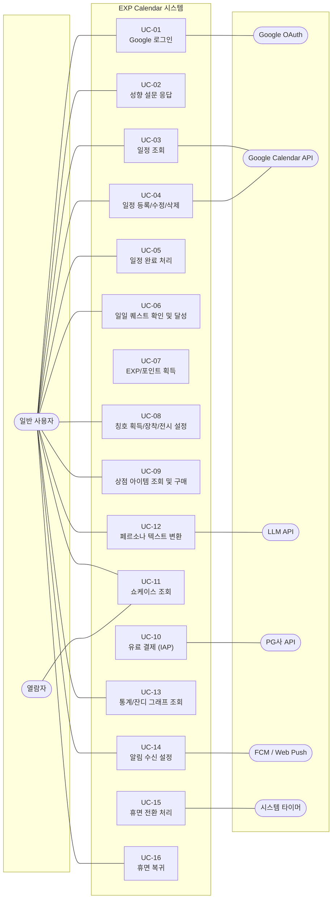
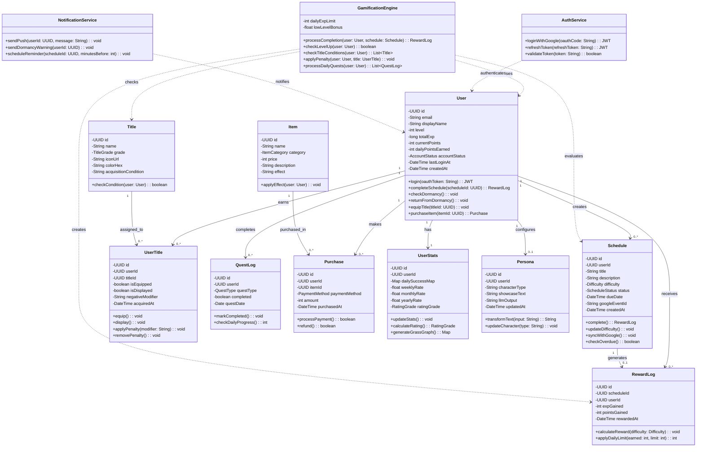
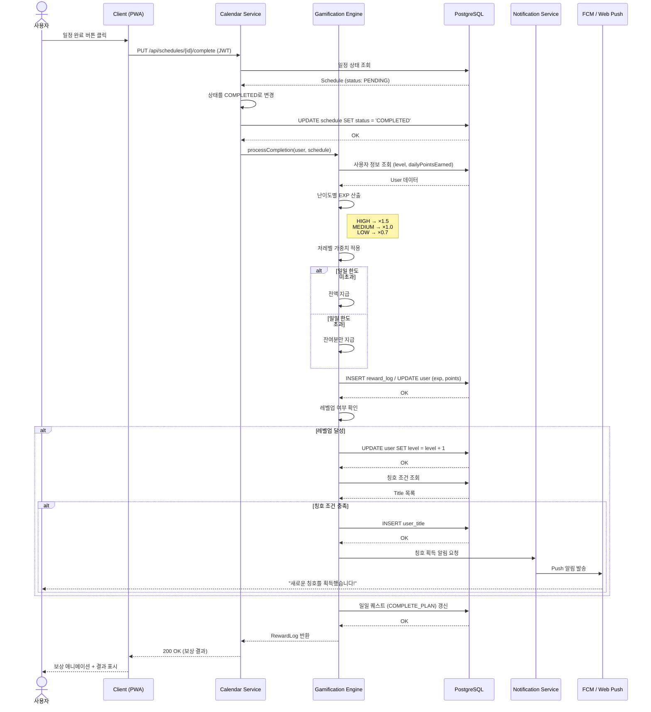
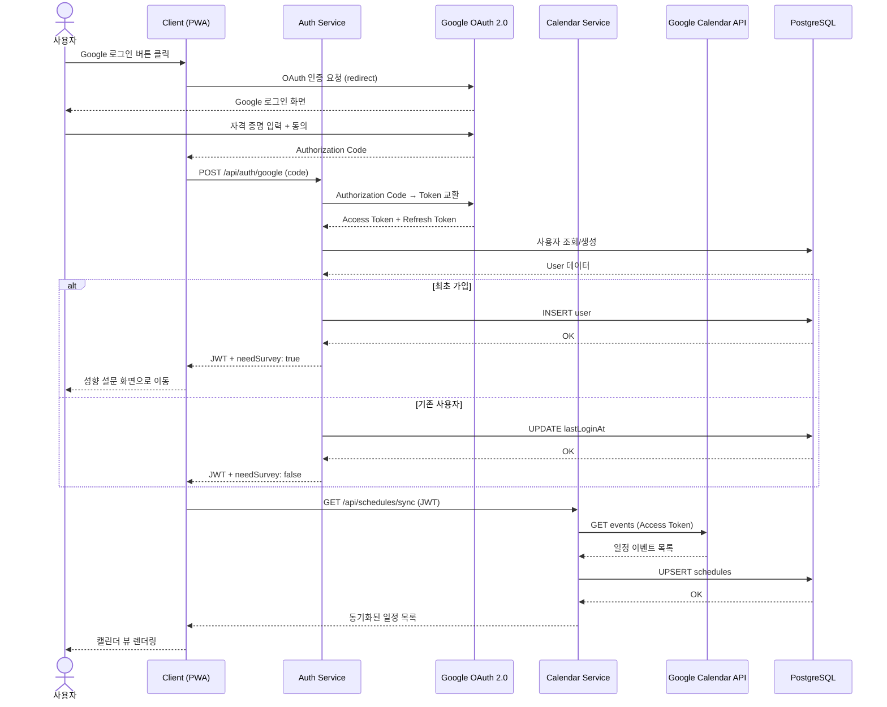
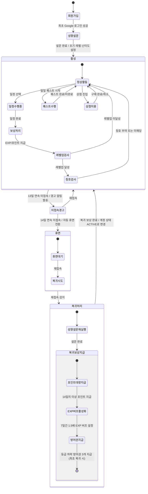
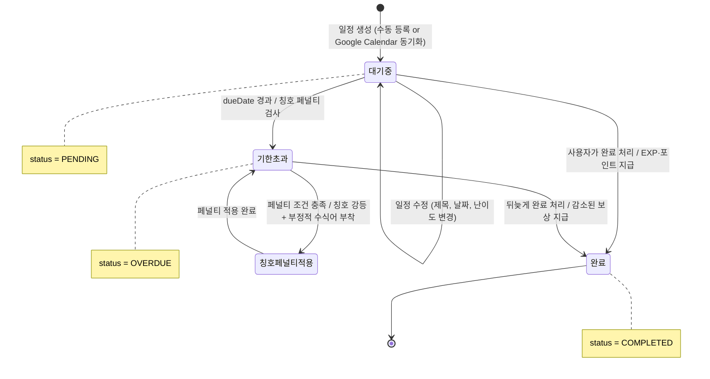
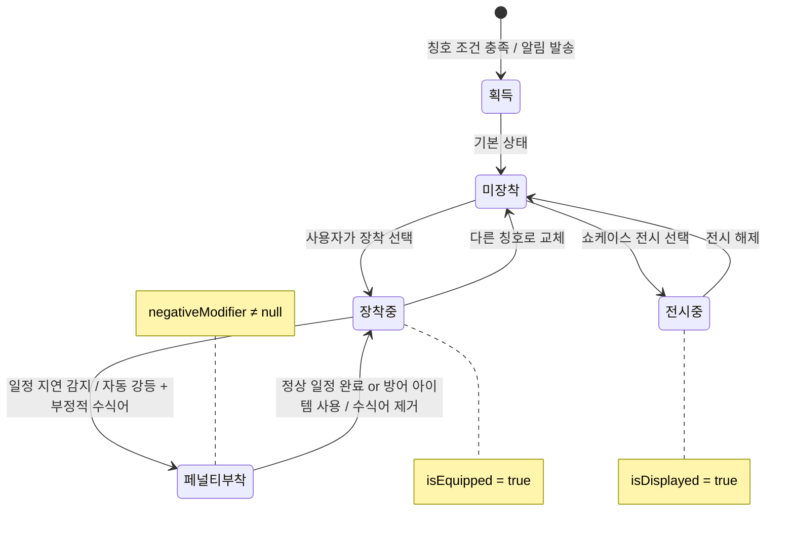

# EXP Calendar — UML 모델링 명세서

> **팀명**: 백정신세  
> **팀원**: 정다우, 신강민, 백인서  
> **프로젝트명**: EXP Calendar — 게이미피케이션 기반 일정 관리 시스템  
> **작성일**: 2026-04-20  

---

## 목차

1. [유스케이스 다이어그램 (Use Case Diagram)](#1-유스케이스-다이어그램-use-case-diagram)
2. [클래스 다이어그램 (Class Diagram)](#2-클래스-다이어그램-class-diagram)
3. [순차 다이어그램 (Sequence Diagram)](#3-순차-다이어그램-sequence-diagram)
4. [상태 다이어그램 (State Diagram)](#4-상태-다이어그램-state-diagram)

---

## 1. 유스케이스 다이어그램 (Use Case Diagram)

### 1.1 시스템 개요

EXP Calendar는 Google Calendar 연동 기반의 게이미피케이션 일정 관리 시스템으로, 사용자의 일정 완료에 대해 EXP·포인트·칭호를 보상하고, LLM 기반 캐릭터 페르소나와 소셜 쇼케이스를 제공한다.

### 1.2 액터 정의

| 액터 | 유형 | 설명 |
|------|------|------|
| **일반 사용자** | 주 액터 | 일정 관리, 퀘스트 수행, 상점 이용 등 모든 기능을 사용하는 사용자 |
| **열람자** | 주 액터 | 타 사용자의 쇼케이스만 열람하는 비주력 사용자 |
| **Google OAuth** | 보조 액터 | 사용자 인증 및 토큰 발급을 처리하는 외부 인증 서비스 |
| **Google Calendar API** | 보조 액터 | 외부 일정 데이터를 제공하는 캘린더 서비스 |
| **LLM API** | 보조 액터 | 캐릭터 성격 기반 텍스트 변환을 수행하는 AI 서비스 |
| **PG사 API** | 보조 액터 | 유료 결제 처리를 담당하는 결제 게이트웨이 |
| **FCM / Web Push** | 보조 액터 | Push 알림 발송을 담당하는 메시징 서비스 |
| **시스템 타이머** | 보조 액터 | 휴면 전환, 일일 퀘스트 초기화 등 스케줄 기반 작업 수행 |

### 1.3 유스케이스 다이어그램

### 1.4 유스케이스 관계

| 관계 유형 | 기본 유스케이스 | 관련 유스케이스 | 설명 |
|-----------|----------------|----------------|------|
| **Include** | UC-01 Google 로그인 | UC-02 성향 설문 응답 | 최초 로그인 시 반드시 성향 설문을 수행한다 |
| **Include** | UC-05 일정 완료 처리 | UC-07 EXP/포인트 획득 | 일정 완료 시 보상이 반드시 지급된다 |
| **Include** | UC-16 휴면 복귀 | UC-02 성향 설문 응답 | 복귀 시 설문을 재실행한다 |
| **Extend** | UC-07 EXP/포인트 획득 | UC-08 칭호 획득 | 레벨업 시 칭호 조건을 검사하여 부여한다 |
| **Extend** | UC-09 상점 아이템 구매 | UC-10 유료 결제 (IAP) | 포인트 부족 시 유료 결제로 확장된다 |
| **Extend** | UC-05 일정 완료 처리 | UC-06 일일 퀘스트 달성 | 완료 시 퀘스트 조건 충족 여부를 검사한다 |
| **Extend** | UC-15 휴면 전환 처리 | UC-14 알림 수신 | 13일차에 경고 알림을 발송한다 |

### 1.5 유스케이스 명세 (주요 항목)

#### UC-05: 일정 완료 처리

| 항목 | 내용 |
|------|------|
| **유스케이스 ID** | UC-05 |
| **유스케이스명** | 일정 완료 처리 |
| **액터** | 일반 사용자 |
| **사전 조건** | 사용자가 로그인 상태이며, 완료할 일정이 존재한다 |
| **기본 흐름** | 1. 사용자가 일정을 선택한다 2. 완료 버튼을 클릭한다 3. 시스템이 일정 상태를 COMPLETED로 변경한다 4. 시스템이 난이도에 따라 EXP/포인트를 산출한다 5. 일일 한도를 확인하여 보상을 지급한다 6. 레벨업 조건 확인 후 칭호 검사를 수행한다 7. 일일 퀘스트 달성 여부를 갱신한다 |
| **대안 흐름** | 5a. 일일 한도 초과 시 잔여분만 지급한다 |
| **사후 조건** | 일정 상태가 COMPLETED로 변경되고, EXP/포인트가 지급된다 |

---

## 2. 클래스 다이어그램 (Class Diagram)

### 2.1 설계 방침

SRS의 논리적 데이터베이스 요구사항(3.4절)과 기능적 요구사항(3.2절)을 기반으로 핵심 도메인 클래스를 도출하였다. 각 클래스의 속성에는 가시성(+public, -private, #protected)을 표기하고, 클래스 간 다중도(multiplicity)와 관계 유형을 명시한다.

### 2.2 클래스 다이어그램

### 2.3 열거형 정의

| 열거형 | 값 | 설명 |
|--------|-----|------|
| **AccountStatus** | `ACTIVE`, `DORMANT` | 계정 활성/휴면 상태 |
| **Difficulty** | `LOW`, `MEDIUM`, `HIGH` | 일정 난이도 |
| **ScheduleStatus** | `PENDING`, `COMPLETED`, `OVERDUE` | 일정 진행 상태 |
| **TitleGrade** | `COMMON`, `RARE`, `EPIC`, `LEGENDARY` | 칭호 등급 |
| **QuestType** | `ADD_PLAN`, `COMPLETE_PLAN`, `VISIT_SHOWCASE` | 일일 퀘스트 유형 |
| **ItemCategory** | `CUSTOMIZE`, `DEFENSE`, `PERSONA` | 상점 아이템 분류 |
| **PaymentMethod** | `POINTS`, `IAP` | 결제 방식 |
| **RatingGrade** | S, A, B, C, D, F | 사용자 활동 등급 |

---

## 3. 순차 다이어그램 (Sequence Diagram)

### 3.1 시나리오: 일정 완료 및 보상 지급

사용자가 일정을 완료하면, 난이도에 따라 EXP/포인트가 산출되고, 일일 한도 확인 후 보상이 지급되며, 레벨업 시 칭호 조건을 검사하는 핵심 프로세스이다.

### 3.2 시나리오: Google 로그인 및 일정 동기화

---

## 4. 상태 다이어그램 (State Diagram)

### 4.1 대상 객체: 사용자 계정 (User Account)

사용자 계정은 생성부터 활성, 휴면, 복귀까지의 상태 전이를 거친다. 14일 미접속 시 자동 휴면 전환되며, 복귀 시 보상 패키지와 함께 재활성화된다.

### 4.2 대상 객체: 일정 (Schedule)

일정은 생성부터 완료 또는 기한 초과까지의 상태 전이를 거친다.

### 4.3 대상 객체: 칭호 (UserTitle)

사용자가 보유한 칭호의 상태 전이를 나타낸다.

---

## 부록: 다이어그램 요약

| # | 다이어그램 | 모델링 대상 | 설명 |
|---|-----------|------------|------|
| 1 | 유스케이스 다이어그램 | 시스템 전체 | 7개 액터, 16개 유스케이스, Include/Extend 관계 정의 |
| 2 | 클래스 다이어그램 | 도메인 모델 | 13개 클래스, 속성·메서드·가시성·다중도·관계 명시 |
| 3 | 순차 다이어그램 | 일정 완료 보상 / 로그인 동기화 | 2개 시나리오의 객체 간 메시지 흐름 |
| 4 | 상태 다이어그램 | User, Schedule, UserTitle | 3개 객체의 상태 전이 설계 |

---

> **참고 문서**: `docs/planning/requirements_ieee830.md` (EXP Calendar SRS v1.0)
